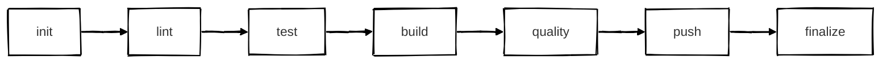
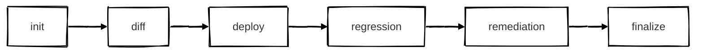

# CI/CD Philosophy

My approach to Continuous Integration and Continuous Deployment emphasizes **fail-fast principles**, **artifact integrity**, and **clear separation of concerns**. Each pipeline stage has a specific purpose, and failures at any stage halt progression to prevent wasted compute and early detection of issues.

## Continuous Integration

A CI pipeline starts when code is pushed to a version control server.

### CI Init Stage

The init stage is triggered by a git push or pull request event. The pipeline:

- Checks out the source code
- Sets up the runtime environment (Node.js, Python, etc.)
- Restores cached dependencies for faster builds

### CI Lint Stage

The lint stage performs static analysis on all files in the repository. This is the first gate because it's fast and catches common issues immediately:

- **Code style violations** - ESLint, Prettier
- **Shell script issues** - ShellCheck
- **Dockerfile best practices** - Hadolint
- **Type errors** - TypeScript compiler

If code doesn't pass lint, there's no point running expensive tests or builds.

### CI Test Stage

The test stage executes **unit tests** only. Unit tests are fast, isolated, and don't require external dependencies. This is not to be confused with:

- **Integration tests** - Run in the quality stage after artifacts are built
- **Regression tests** - Run in the CD pipeline after deployment

### CI Build Stage

The build stage generates deployable artifacts:

- Compiled applications
- Docker container images
- Static site bundles
- Archive files (tar, zip)

These artifacts are versioned and stored for later stages.

### CI Quality Stage

The quality stage validates the **built artifacts** through:

- **Security scanning** - Trivy for CVEs, secrets, misconfigurations
- **Integration tests** - End-to-end tests against running containers
- **Dependency audits** - npm audit, pip-audit
- **Code quality analysis** - SonarQube for bugs, code smells, coverage

This stage runs after build because it needs the actual artifacts to scan and test.

### CI Push Stage

The push stage publishes validated artifacts to artifact stores:

- Container registries (ECR, Docker Hub, GHCR)
- Package registries (npm, PyPI)
- Object storage (S3, GCS)

Only artifacts that pass all quality gates are pushed.

### CI Finalize Stage

The finalize stage completes the CI pipeline:

- Generate pipeline summary reports
- Send notifications to ChatOps channels (Slack, Teams)
- Create git tags marking successful builds
- Trigger downstream CD pipelines

---

## Continuous Deployment

CD pipelines are triggered by git tags created during CI, ensuring only validated artifacts are deployed.

### CD Init Stage

The init stage picks up the artifact corresponding to the git tag:

- Pull container image from registry
- Download build artifacts from storage
- Validate artifact signatures/checksums

### CD Diff Stage

Before deployment, a diff shows what will change:

- **Kubernetes** - `helm diff` shows manifest changes
- **Terraform** - `terraform plan` shows infrastructure changes
- **Database** - Migration previews show schema changes

This provides visibility and can gate deployments requiring approval.

### CD Deploy Stage

The deploy stage applies changes to the target environment:

- Rolling updates for zero-downtime deployments
- Blue/green or canary strategies for risk mitigation
- Database migrations with rollback capabilities

### CD Regression Stage

After deployment, regression tests validate the live environment:

- Smoke tests verify critical paths work
- API contract tests ensure backwards compatibility
- Performance tests catch degradation
- Security scans of running infrastructure

### CD Remediation Stage

If regression tests fail, automated remediation kicks in:

- **Rollback** - Revert to previous known-good version
- **Alerting** - Page on-call engineers
- **Incident creation** - Open tickets for tracking

### CD Finalize Stage

The finalize stage completes the CD pipeline:

- Update deployment tracking systems
- Send success/failure notifications
- Update dashboards and metrics
- Close deployment tickets

---

## Principles

1. **Fail Fast** - Cheap checks run first; expensive checks run last
2. **Artifact Integrity** - Build once, deploy everywhere
3. **Immutable Artifacts** - Never modify artifacts after build
4. **Gated Progression** - Each stage must pass before the next
5. **Observability** - Every stage produces logs, metrics, and traces
6. **Reproducibility** - Any build can be recreated from git tag
